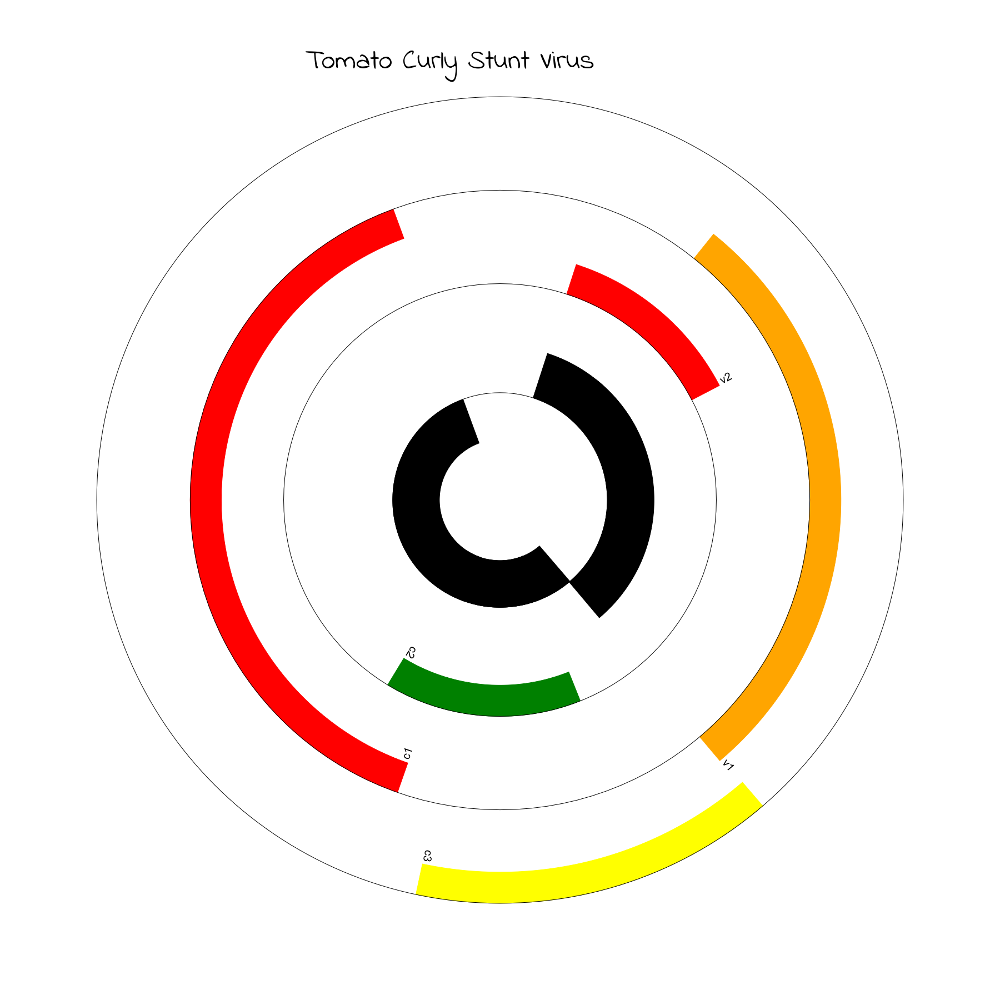

# ACM Research Coding Challenge (Spring 2021)

**Solution**  
After I read the question, my first thought was to use PIL library, which is image editor library. I planned on learning how manually make a genome circular diagram,
but then I came across "Biopython" while I researched genome map python parser, which I later chose mainly. Then I looked at the documentation for biopython and how to 
make an image.

**Difficulties**  
The part where I struggled with is that I tried to add a title and there was not an easy way to add text. Since it was hard, I also include the PIL library to add text.
I just chose a random font from google fonts website. One problem with the image was that the png had only one color making it difficult to see the distinct features.
I chose to change the colors of the feature because it makes it easier to see the features. I also added separate tracks so the features don't overlap.

**Citations**  
https://fonts.google.com/

https://biopython.org/docs/1.75/api/Bio.Graphics.GenomeDiagram.html

https://biopython-tutorial.readthedocs.io/en/latest/notebooks/17%20-%20Graphics%20including%20GenomeDiagram.html#A-top-down-example

http://biopython.org/DIST/docs/tutorial/Tutorial.html
